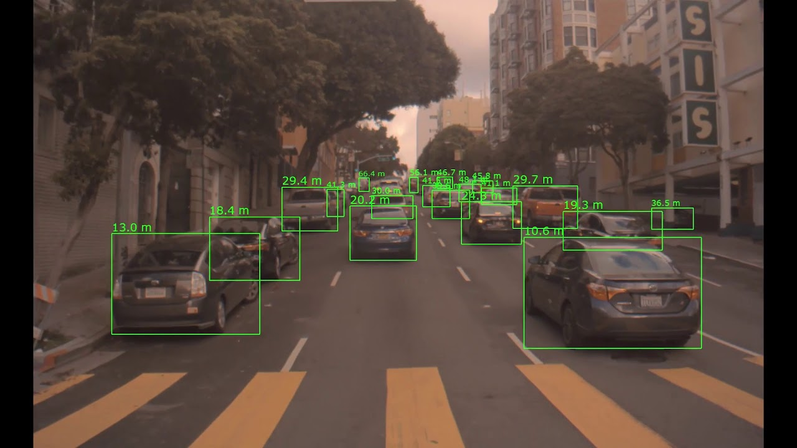
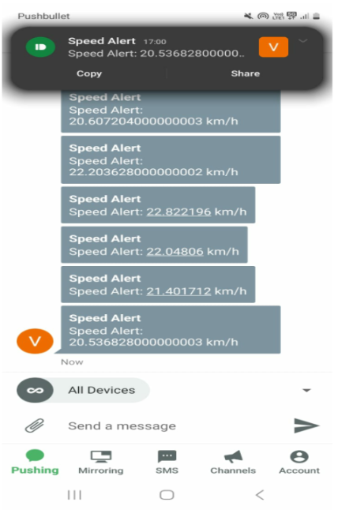

# DRIVEMON AI

🚗 **DRIVEMON AI: IoT-Based Driver Monitoring and Speed Alert System with Object Detection**

## Overview
DRIVEMON AI is a real-time **IoT-based Driver Monitoring System** that integrates GPS-based speed tracking, object detection, and AI-powered alerts to enhance road safety. This project uses **OpenCV** and **YOLOv4-Tiny** to detect objects in front of the vehicle and notify clients when the vehicle exceeds speed thresholds or is at risk of collision.

## Features
- Real-time vehicle speed tracking via GPS
- Object detection using **YOLOv4-Tiny** and **OpenCV**
- Automatic speed threshold alert system
- Proximity-based collision risk detection
- Push notification to client devices using **Pushbullet API**
- Web interface to monitor speed, objects, and alerts

## Tech Stack
- Python
- Flask
- OpenCV
- Socket.IO
- Raspberry Pi
- GPS Neo6M Module
- Raspberry Pi Camera Module
- Pushbullet API
- YOLOv4-Tiny (Pre-trained model)

## How It Works
1. **Speed Monitoring**: GPS continuously tracks the vehicle's speed.
2. **Object Detection**: The camera module captures frames in real-time.
3. **Object Identification**: The captured frames are processed using YOLOv4-Tiny with OpenCV to detect objects like cars, pedestrians, and obstacles.
4. **Collision Alert**: If an object is detected too close while the speed is above the threshold, a warning is sent to the client.
5. **Client Notification**: Pushbullet API sends notifications to registered devices when:
    - Speed exceeds the threshold
    - Object is detected too close at high speed
6. **Web Dashboard**: Users can monitor speed, location, and object detection results from the web interface.

## Installation
### Prerequisites
- Python 3.8 or above
- Raspberry Pi OS (32-bit recommended)
- Raspberry Pi Camera Module
- GPS Neo6M Module

### Libraries Installation
```bash
pip install Flask Flask-SocketIO opencv-python Pushbullet.py geopy socketio
```

### Model Files
Download the following files from their official sources and place them in the project directory:
- [`yolov4-tiny.cfg`](https://github.com/AlexeyAB/darknet/blob/master/cfg/yolov4-tiny.cfg)
- [`yolov4-tiny.weights`](https://github.com/AlexeyAB/darknet/releases/download/yolov4/yolov4-tiny.weights)
- [`coco.names`](https://github.com/pjreddie/darknet/blob/master/data/coco.names)

### Folder Structure
```
📁 DRIVEMON AI
│
├─ gps.py             # GPS Speed Monitoring
├─ final.py          # Object Detection and Client Notifications
├─ 📁templates/index.html        # Web Dashboard
├─ yolov4-tiny.cfg   # YOLOv4-Tiny Configuration
├─ yolov4-tiny.weights # YOLOv4-Tiny Weights
└─ coco.names        # COCO Class Labels
```

## Usage
1. Connect GPS and Camera modules to Raspberry Pi.
2. Run the `gps.py` file for GPS speed monitoring.
```bash
python gps.py
```
3. Run the `final.py` file to start object detection and notifications.
```bash
python final.py
```

## Demo
- 
- Push notifications are sent:
- 
## Future Scope
- Automatic braking system integration
- Driver fatigue detection
- Cloud-based data storage for remote monitoring

## Contributing
Feel free to contribute to this project by submitting pull requests or opening issues.

## License
This project is licensed under the MIT License.

---

Developed by **Jeet Soni**

Let's drive safely with **AI-powered intelligent driving systems!** 🔥🚗
